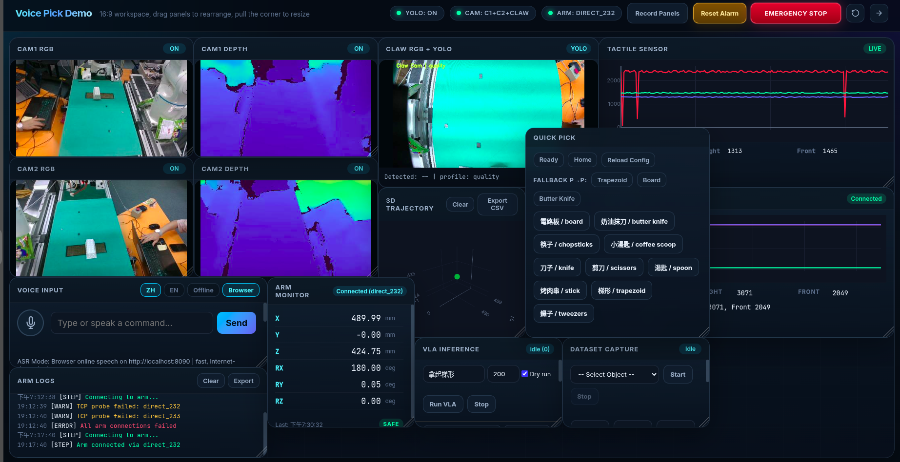
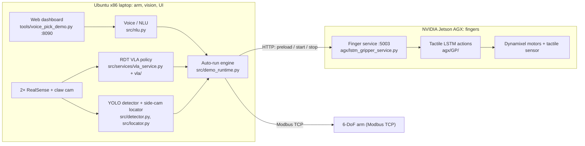

# Voice Pick VLA

A voice-commanded pick-and-place system that combines a **Vision-Language-Action (VLA)
policy** for arm motion with a **tactile LSTM controller** for the fingers. An operator
says (or types) "拿起梯形" / "pick up the butter knife". The system localizes the
object, moves the arm over it, and hands control to a tactile-driven gripper that
grasps and releases.



## System overview

The system runs on two machines:



- **Laptop (this repo's root).** It owns the arm, the cameras, the VLA policy, the YOLO
  pipeline and the operator UI. It is the only machine that moves the arm.
- **AGX (`agx/`).** It owns the finger motors and the tactile sensor. It runs one
  service that exposes the LSTM grasp/release actions over HTTP (see
  [ADR 0001](docs/adr/0001-agx-single-finger-service.md)).

### Pick flow

1. **Voice → intent.** Browser ASR (zh-TW / English) sends all of its candidates.
   The server picks the first one that names a known object, with a homophone pass
   as fallback ([ADR 0004](docs/adr/0004-asr-tolerant-voice-matching.md)). The
   operator confirms before anything moves.
2. **Approach.** The RDT VLA policy predicts the arm motion from two RealSense views
   and the claw camera. A *blind-state* checkpoint zeroes the proprioceptive token
   so the policy localizes from vision.
3. **Arrival check.** The arm descends only when both of these hold: the claw-cam
   YOLO box sits on the per-object *on-top setpoint*, and the VLA's predicted next
   step is small. If the box is off, a pixel-error servo corrects x/y at hover
   height.
4. **Handoff gate.** At grasp height the laptop pauses and triggers the AGX finger
   action. Models are preloaded during the approach, so there is no loading lag.
5. **Release.** The arm carries the object to the release point, triggers the
   release action, and returns to the ready pose.

**Fallback ladder** (per object): VLA → YOLO pick pipeline (side-cam locator + claw
servo) → taught pose → fully scripted pick-and-place. See `CONTEXT.md` for the full
domain glossary and `docs/adr/` for the design decisions.

## Repository layout

```text
src/                 laptop runtime: launcher, config, auto-run engine, NLU, arrival check
  services/          arm (Modbus), RealSense, claw camera, gripper client, VLA, recording
tools/               Flask + Socket.IO dashboard, calibration, dataset preparation
  static/            dashboard front-end
vla/                 RDT model code used for inference (see THIRD_PARTY_NOTICES.md)
scripts/             deploy / run scripts, calibration, offline evaluation, VLA debugging
tests/               unit tests for the auto-run, fallback, NLU and UI logic
config/              demo, modbus, object and voice config; env/ubuntu.example.yaml
data/calibration/    claw arrival setpoints, servo and side-cam locator calibration
docs/                operations manual, deploy guide, config map, ADRs
agx/
  lstm_gripper_service.py   finger service (LSTM actions + gripper HTTP API)
  GP/                       tactile LSTM / RNN / Transformer finger controllers and training
  motor/                    earlier motor, Arduino/STM tactile and data-recording tools
```

## Getting started

### Laptop (Ubuntu 22.04, x86_64)

```bash
cp config/env/ubuntu.example.yaml config/env/ubuntu.local.yaml   # set IPs, camera serials, model paths
bash scripts/deploy_ubuntu.sh       # creates venv, installs requirements
bash scripts/preflight_ubuntu.sh    # checks config, RealSense and other hardware
bash scripts/run_demo.sh full       # then open http://<laptop-ip>:8090
```

`config/env/ubuntu.local.yaml` is machine-specific and git-ignored. See
[docs/CONFIG_MAP.md](docs/CONFIG_MAP.md) and [docs/UBUNTU_DEPLOY.md](docs/UBUNTU_DEPLOY.md).

### AGX

```bash
scp agx/lstm_gripper_service.py agx:~/Desktop/GP/
ssh agx 'cd ~/Desktop/GP && pipenv run python lstm_gripper_service.py'
```

The service reads the LSTM weights from `training_pack/model_pack/LSTM/` next to
itself. To use another location, set `GP_MODEL_DIR`. See
[docs/MANUAL_THREEOBJ_DEMO.md](docs/MANUAL_THREEOBJ_DEMO.md) for the full three-object
demo procedure.

## Model weights and data

Weights are not tracked in git. Download them from the
[Releases](../../releases) page:

| Asset | Used by | Put at |
|---|---|---|
| `yolo_models.zip` | claw-cam / side-cam detection | `data/models/yolo/` |
| `vla_instruction_embeddings.zip` | VLA language conditioning | `data/` |
| `agx_lstm_model_pack.zip` | AGX finger actions | `~/Desktop/GP/training_pack/model_pack/LSTM/` on the AGX |

The fine-tuned RDT checkpoint and the recorded VLA datasets (about 27 GB) are not
published.

## Credits

- **VLA backbone:** [RDT-1B (Robotics Diffusion Transformer)](https://github.com/thu-ml/RoboticsDiffusionTransformer).
  Model code in `vla/` is adapted from it. See [THIRD_PARTY_NOTICES.md](THIRD_PARTY_NOTICES.md).
- **Tactile finger control (`agx/GP/`, `agx/motor/`):** developed by teammates
  潘彥丞, 冷堂愷, 陳旻佑, 吳丞恩 and 方信筌. It is integrated here with their permission.
- Laptop-side system (arm control, vision pipeline, VLA deployment, voice interface,
  dashboard, AGX finger service integration): <!-- TODO: your name --> (@bubbleee030).

## License

No license has been chosen yet; all rights reserved. Third-party code in `vla/` stays
under its original license (see `THIRD_PARTY_NOTICES.md`).
